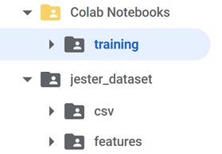

# DEVICE CONTROL WITH GESTURES ‼️10:42‼️ 🕐
Final project for the 2020-2021 Postgraduate course on Artificial Intelligence with Deep Learning, UPC School, authored by **Enrique González Terceño**, **Sofia Limon**, **Gerard Pons** and **Celia Santos**. 

Advised by **Amanda Duarte**.

## TABLE OF CONTENTS
[INTRODUCTION AND MOTIVATION](#introduction-and-motivation)

[DATASET](#dataset)

[ARCHITECTURE AND RESULTS](#architecture-and-results)

[ABLATION STUDIES](#ablation-studies)

[END TO END SYSTEM](#end-to-end-system)

[HOW TO RUN THE TRAINING](#how-to-run-the-training)

[HOW TO RUN THE PROGRAM](#how-to-run-the-program)


## INTRODUCTION AND MOTIVATION

How many times have you been watching TV and couldn't find the remote? Or you are cooking, eating... and your hands are too messy to interact with a device? Or maybe you would simply like to use devices more intuitively. We use gestures every day of our life, as our primary way of interacting with other humans. Our project emerges as a way to interact with devices in an easier, more convenient manner.

We have created a gesture recognition system that works by capturing videos with a camera, to perform basic tasks on a personal device. But our idea is that it can be further developed to different environments, like for virtual assistants or home appliances, or in a car (instead of taking your eyes off the road, you can control the navigation system a gesture and avoid any potential risks), or in a medical environment (for instance for a doctor to explore a radiography in a middle of a surgery).


## DATASET

The data we used to train and validate our model was from the [Jester Dataset](https://20bn.com/datasets/jester), which is a label collection of videos of humans performing hand gestures. The data is given in the JPG frames of the videos, which were recorded at 12 fps. Specifically, the dataset contains 150k videos of 27 different classes. 


As the goal of our project was to control basic functionalities of a computer, we decided to reduce the number of classes and to choose 9 gestures which made more sense from a control point of view. The used classes and the number of samples of each one are:

|          Gesture         | Train Samples | Validation Samples |
|:------------------------:|:-------:|:--------:|
|    Doing Other Things    |  9592 |1468|
|        No Gesture        |   4287  |533|
| Sliding Two Fingers Down |   4348  | 531|
|  Sliding Two Fingers Up  |   4219  | 522|
|         Stop Sign        |   4337  | 536|
|       Swiping Left       |   4162  | 494|
|       Swiping Right      |    4084 | 486|
|         Thumb Up         |   4373  | 539|
|  Turning Hand Clockwise  |    3126 |385 |

The first two classes, Doing Other Things and No Gesture, were added to our list of classes in order to have basic states when we are not trying to control the computer.


The Jester test set provided is unlabeled, as the purpose of the dataset is to be a competition. Hence, as the end goal of the classifier is to be used with user inputs from a webcam, we decided to perform the test phase with videos created by us on the end to end system.


## ARCHITECTURE AND RESULTS

To better understand the model’s architecture, the general pipeline should be first briefly explained. First of all, when an RGB video is received its optical flow is computed and features are extracted from both videos using an I3D Network. Then, these features are fed into a Neural Network, whose output are the probabilities for each class.


It must be noted that the decision of using RGB and Optical Flow videos was made after [different attempts](#model-improvements) to improve the model.


### Optical Flow:
We computed the dense Optical Flow with the Farneback’s algorithm implementation of OpenCV. As the videos of the dataset have a low resolution and experience a lot of lightning changes, the Optical Flow results showed some imperfections, which we tried to solve by [different approaches](#optical-flow-improvements). Unfortunately, we could not find how to correct them, and decided to move on with the Optical Flow we had in order to be able to continue advancing with the project.


### I3D
In order to extract features from the videos (both RGB and Optical Flow) we used an Inflated 3D Network (I3D), as it is a widely used network for video classification, able to learn spatiotemporal information from the videos. In our case, the chosen I3D had weight initialization from a ResNet50 network trained on Imagenet, and was also pre-trained on the action recognition dataset Kinetics-400, since it’s an state-of-the-art model with a good balance between accuracy and computational requirements. The model is provided by [GluonCV](https://cv.gluon.ai/) and runs on MXnet.

### Classifier Neural Network
The RGB and the Optical Flow videos are processed by the previously mentioned I3D network, and features for both of them are obtained and go through a [neural network architecture with two streams](https://github.com/gesturesAidl/video_processor/blob/main/app/GesturesAnalyzer/Classifier2stream.py), which was designed considering the [different options](#feature-joinig) of how to combine the features. Briefly, both features go through their respective branches of the neural network and the output logits are added up, go through a LogSoftMax layer whose output are the final probabilities. This network was trained and [hyperparameter-tuned](#hyperparameter-tuning) to yield the final results: 

:bangbang: PLOT OF THE BEST RESULTS

This model saved and used on the final gesture recognition task.

## ABLATION STUDIES

### OPTICAL FLOW IMPROVEMENTS

:bangbang: 

### FEATURE JOINING

One of the decisions we had to make is how to join the RGB and Optical Flow, and we explored various possibilities based on the ones mentioned in a [paper](http://vision.soic.indiana.edu/papers/extremelylow2018wacv.pdf) of action recognition for low resolution videos:
* Addition of the I3D features
* Concatenation of the I3D features
* Maximal value retention for each I3D features
* Addition of the logits from two different networks

The first three methods are based on the use of a single NN to classify the features, whereas the last one uses two different NNs, one for the RGB features and another one for the Optical Flow ones. The method with which the features are joined can have great impact on our network, as the number of layers, network parameters and hyperparameters to tune changes between them, so deciding which one to use was crucial to be able to start with an appropriate training of the network.

Hence, we tested the different methods with similar standard networks. We obtained the results shown on the figure below, and as we can see the performance is quite similar for all of the methods, with the concatenation (Concat) and logit addition (Sum after) methods performing slightly better than the other ones.

To decide which method to use we explored the number of parameters, to try to minimize computational time/cost, and of hyperparameters, to account for the tunability of the model. Regarding the parameters of the networks, both have a very similar number of them, with a difference on parameters of three orders of magnitude lower than the total number of parameters, so it was considered negligible. With respect to the tunability, the method that adds up the logits has nearly the double of hyperparameters as the concatenation method, so we decided to use the former in our architecture.


### MODEL IMPROVEMENTS

#### FIRST APPROACH: RGB VIDEOS

The first way we explored to address the classification task was using only the extracted features from the RGB videos to classify them. After some training and hyperparameter tuning, the obtained accuracy was around 70%, which was still far from our desired accuracy values. To try to understand better where the model was struggling, we computed the confusion matrix of the predictions and some revealing results where found: the model encountered difficulties when differentiating the gestures that are the same movement but in different directions (i.e. Swiping left/Swiping right) and also differentiating similar gestures which differ from one another mainly by the movement (Stop Sign/Turning Hand Clockwise).

To address that problem, we thought that we could capture better the temporal and directional information by computing the Optical Flow of the videos and extract features from them.


#### SECOND APPROACH: OPTICAL FLOW VIDEOS

After training the model with only the Optical Flow features, following the same steps that had been done during the first approach, it was observed that while the accuracy of the whole model diminished, as the model could not classify well the videos with little movement (Stop Sign, Thumb Up). However, the confusion between the troublesome gestures was reduced, confirming the hypothesis that better directional information was captured.


A detailed accuracy comparison between the two approaches can be seen on the table below:

|          Gesture         | RGB accuracy | FLOW accuracy|
|:------------------------:|:-------:|:------:
|    Doing Other Things    | 0.954  | 0.795|
|        No Gesture        |   0.913  |0.719|
| Sliding Two Fingers Down |    0.568| 0.598  |
|  Sliding Two Fingers Up  |    0.367 | 0.523|
|         Stop Sign        |    0.774   | 0.348|
|       Swiping Left       |   0.567 | 0.578|
|       Swiping Right      |    0.344 | 0.609 |
|         Thumb Up         |  0.742  | 0.380|
|  Turning Hand Clockwise  |   0.867 |0.566|


#### THIRD APPROACH: TWO STREAM (RGB AND OPTICAL FLOW VIDEOS)

From the first and second approaches, we decided to use a model with two streams, following the ideas of the **Quo Vadis, Action Recognition?** [paper](https://arxiv.org/pdf/1705.07750.pdf): We use one stream for RGB videos to help with the general classification task and the other one for the Optical Flow to address the confusion problem, and combine them as stated on the the previous section. Doing so doubles the amount of data and computer time/cost but was done in the hope of the model being able to keep the best parts of both approaches and yield better results. As it can be observed on the figure, our hypothesis was true and the network managed to learn appropriately from the two streams of data and improved the overall accuracy, which went from 70% of the RGB videos and 57% of the Optical Flow ones up to +80%, a significant increase. 


### HYPERPARAMETER TUNING

To try to get the best results possible, an extensive hyperparameter tuning was performed (note that it was done in all the three approaches described on the previous section). In the most relevant approach, the third one, the tuned parameters were: 

|          Parameter         | Value Range |
|:--------------------------:|:-----:|
|    Learning Rate           | loguniform(log(1e-4), log(1e-2)) |
|        Batch Size        |   choice(8, 16, 32, 64, 128, 256)  |
| RGB Hidden Layer |   choice(128, 256, 512, 1024, 2048) | 
|  Flow Hidden Layer  |  choice(128, 256, 512, 1024, 2048)  | 

:bangbang: WE SHOULD ADD A LITTLE EXPLANATION OF THE SCHEDUELRS OR SEARCH ALGORITHM USED, I DON'T REMEMBER IT WELL ENOUGH TO EXPLAIN THEM. ENRIQUE SEND HELP

The best model we found had a 83.11%, with the following parameters:

|          Parameter         | Value Range |
|:--------------------------:|:-----:|
|    Learning Rate           | 0.000178044 |
|        Batch Size        |   64  |
| RGB Hidden Layer |   1024 | 
|  Flow Hidden Layer  |  1024  | 

:bangbang: THE BEST PLOT SHOULD BE ON THE ARCHITCTURE AND RESULTS SECTION, SO I DON'T WHAT FIGURE, IF ANY, SHOULD BE SHOWN HERE


#### DROPOUT

Due to the size of our dataset, the model overfitted rapidly if no dropout was applied. We found out that dropout values ranging from 0.5 to 0.8 enabled the model to learn further. Precisely, the final model obtained used dropout layers of 0.5 in both network streams.


### DATA AUGMENTATION

We tried to further increase the accuracy by performing some data augmentation on training data. 

Since our dataset (Jester's subset) consists of videos in the form of frames, we could do this data augmentation either on the images or in the videos we make from them. We chose to apply it directly on the images as they are the primary source and it was easier to work with them; the script [frameaug2video.py](https://github.com/gesturesAidl/video_processor/blob/main/scripts/augmentation/frameaug2video.py) does the augmentation on the training images and creates the augmented videos from them.

We made use of the [imgaug](https://github.com/aleju/imgaug) library to make this image transformations. This library allows to select and stack a [wide range](https://imgaug.readthedocs.io/en/latest/source/overview_of_augmenters.html) of them, including arithmetic (adding noise) and geometric changes, color, flips, pooling, resizing, etc. It was somehow complicated for us to chose a transformation (or a combination of them) since it had to be sufficiently relevant to improve our model but also enough careful to keep the gesture information. Besides of that, some transformations than can augment RGB videos don't change anything in the Optical Flow or even can ruin it.

So, keeping in mind our dataset and data treatment restrictions for our task: 
* As we were working with Optical Flow, we could not apply blurs, adding noise or other image manipulation techniques that involved creating artificial motion as the resulting Optical Flow turned out to be completely useless.
* As we had direction-dependant gestures, horizontal flips had to be discarded.

We carried out a total of three trials in the search of the best transformations to be applied. Each of them includes the processes of data augmentation on training data: making augmented RGB videos from frames, extracting optical flow from them, extraction of augmented RGB and flow features and, finally, combination of previous features with the augmented ones in a single pickle file (one for RGB and another one for Flow) to feed the classifier network and train the model. Therefore, is a significant time-consuming task.

An scheme of the process is shown in the following picture:


To evaluate the trials we were using the final two-stream model and the script [main_two_stream_OneCycleLR_save_best_model.ipynb](https://github.com/gesturesAidl/video_processor/blob/main/scripts/training/main_two_stream_OneCycleLR_save_best_model.ipynb) with the following hyperparameters (those of the best model):

|Hyperparameter|Value      |
|:------------:|:---------:|
|lr            |0.000178044|
|batch_size    |64         |
|hidden_rgb    |1024       |
|hidden_flow   |1024       |
|dropout       |0.5        |
|epochs        |100        |


Make sure:
  1.  That the pickle files fed to the model (the ones in **/jester_dataset/features** folder in Google Drive) correspond to the augmented dataset and 
  2. That in **/jester_dataset/csv**  folder there are the right files from *csv_augm* folder that can be found [here](https://drive.google.com/drive/folders/1T6eHjss8IHV7yr_Z277kyP2_trtpFP2i?usp=sharing) inside **jester_dataset**.

---

#### Data augmentation - Trial I

In the first trial we applied a 15% zoom in the images, followed by random controlled changes in contrast, brightness, hue and saturation (the same for all the frames inside of a video).

The results are as follows:

As can be seen, overfitting occurs from epoch 48 approx. There isn’t any improvement due to data augmentation since validation loss is lower than the best values obtained :bangbang: previously :bangbang:, besides the fact that validation accuracy doesn't even reach 0.8.

---

#### Data augmentation - Trial II

As the first trial didn't improve the previous results, in the second one we tried another kind of transformations. We applied a 20% random translation in both directions in the images (the same for all the frames inside of a video).


Results are way better than those in previous trial. If we take a closer look at validation values:


We see that the model overfits above epoch 53 approx. At this time the validation accuracy reaches a peak value of 0.8325, which is a minor improvement over the previous best value obtained without augmentation that was 0.8312. However, it must be taken into account that, excluding this point, all the previous accuracy values were below 0.825.

---

#### Data augmentation - Trial III

Encouraged by the increase in accuracy in Trial II, we kept the same translation change that seemed to work in the right direction but adding a previous 15% zoom in the images. The results can be viewed below:


Once again overfitting is observed for epochs > 40 and accuracy doesn’t even reach 0.8 one more time. It seems that applying zoom isn’t suitable for augmenting our data.

---

#### Data augmentation - Conclusions
A series of trials were carried out to have more data to train our network in the hope of obtaining a better global accuracy. Unfortunately, the obtained results did not show an improvement from the best model we already had, so further exploration of the technique was discarded.

Some of the reasons of why data augmentation haven't helped with our task could be:
  - Not being able to fine-tune the last layers of the *i3d_resnet50_v1_kinetics400* Mxnet model by unfreezing them, only the classifier could be trained. Thus, adding more training videos didn't result in a improvement because the classifier was already fitted for our task. That is also the reason why the augmented model presented overfitting over epoch 40 while the original one didn't.
  - The pre-trained *i3d_resnet50_v1_kinetics400* Mxnet model took already into account this sort of basic transformations to images (videos) in its ImageNet and Kinetics training, therefore feeding new similar ones didn't contribute to relevant information for our Deep Learning network.
  - Or, perhaps, we just weren't able to find the right transformations to apply, and introducing this way new information to make a more robust network capable of better inferring.


## END TO END SYSTEM

As stated in the introduction, our project goal was not only to train a working classifier but to use it to control a device. In our case, we decided to control our personal computer mapping some hand gestures to actions that will be displayed in a file window on a computer with a Linux OS GUI. 


|          Gesture         | Action  |
|:------------------------:|:-------:|
|         Thumb Up         |   Create a file  | 
|         Stop Sign        |  Close opened file  | 
|  Sliding Two Fingers Up  |   Create directory  | 
| Sliding Two Fingers Down |   Remove all in directory  | 
|       Swiping Left       |   Move to previous directory  | 
|       Swiping Right      |  Move to forward directory  | 
|  Turning Hand Clockwise  |   Close info/error popup  |

*Note that the classes No Gesture and Doing Other Things are obviously not mapped to any action.*

Briefly, the way the whole system works is as follows: videos are captured in our computer, sent to the Cloud where they are processed and classified, and then a response is returned and the computer performs the action contained on it. To manage the message sending in between the two machines, we used the message broker [RabbitMQ](https://www.rabbitmq.com/).


#### VIDEO CAPTURING

To be consistent with the training data, the videos processed will be 3 seconds long, captured at 12 fps and of the typical Jestser Dataset size ``[170,100]``. As once we send the message containing a video it waits for a response, there is approximately one second (the time it usually takes to process the video) where the webcam is not recording. In order to help the user with the gesture timing, we added a dot on the screen that will be green if the camera is recording, and red if not. 


#### VIDEO PROCESSING

Once the videos are received on Google Cloud, their Optical Flow is computed and the respective features are extracted from them, which go through the classification network. Then, a message is sent to our computer containing the class with the highest probability as well as the probability value.

#### ACTION EXECUTION

When the response message is received, if the probability value exceeds a certain threshold the corresponding action is executed. We use thresholds because as we are performing real actions on the computer, we want the model to be confident enough on the predictions.


A full demo of all gestures with the corresponding Linux actions can be seen [here](https://www.youtube.com/watch?v=G59jl27JF2A).

# HOW TO
    
## HOW TO PREPARE THE DATASET FROM SCRATCH

##### Download Jester Dataset
In order to download the Jester Dataset, go to its [official web page](https://20bn.com/datasets/jester) and then go to [download section](https://20bn.com/datasets/download). 

> Notice that it is required to create an account in order to be able to download the dataset. 

Download all the files with name `20bn-jester-v1-xx` where xx is a number from 00 to 22 in your computer, all in the same directory. Once you have the 23 files downloaded, extract using:
```bash
$ cat 20bn-jester-v1-?? | tar zx 
```
This command will create a folder in your computer named `20bn-jester-v1` with **148.092** folders inside, and each one containing an average of 35 images in `.jpg` format (video frames of 3 seconds).

Create a new folder in your computer with name `csvs` and download the following files from the same Jestes Dataset downloads page: 

    train.csv
    validation.csv
    test.csv
    labels.csv
    
Now you have the entire dataset ready and we need to clean it in order to get rid of the classes that are out of the scope of this project (Remember, we are only going to keep and train **9** classes of the 27 the dataset provides).

##### Clean dataset

CLEAN VIDEOS 

Now, we need to separate and remove all the videos from the classes that we won't use. We have 3 sets: train, validation and test. As the test set is not tagged and labeled, we cannot easily discard the videos from the classes we do not use.  So the first step is to remove all the videos from unused classes of the traning and validation set, and separate the test ones.

To do so, we will use the file [delete_unuseful_classes.py](scripts/preprocessing/delete_unuseful_classes.py).

Change variables `abs_path_to_csvs` and `abs_path_to_dataset` in order to add the absolute path to your `csvs` folder and `20bn-jester-v1` respectively. 

This script will only keep the train and validation videos of our useful 9 classes, and move to a new folder named `test_set` all the videos from the test set. This folder will be created in `abs_path_to_dataset_folder` you defined.

CLEAN CSVS

Delete all rows of the downloaded csvs to keep only the useful ones. We will use the file [delete_unuseful_classes_csvs.py](scripts/preprocessing/delete_unuseful_classes_csvs.py). To do so, replace the `path_to_csvs_folder` variable with the absolute path to your downloaded `csvs` folder. This script will create a new folder at the same folder level with name `clean_csvs` with the csv files filtered in order to only keep the labels of the useful classes. 

##### Convert video frames to video format
At that point, we have a bunch of folders with `.jpg` frames inside it. In order to perform all other actions (extract optical flow and extract features), we need to have them all in a video format.  To do so, we will use the following script:  [frame2video.py](scripts/preprocessing/frame2video.py). We have to indicate the folder where the dataset is stored in `abs_path_to_dataset` variable  and run the script.  THis script  will create a new folder in the same directory called `videos` with the same structure than the `20bn-jester-v1` one. But inside each subfolder named with a number, it will contain a single file with extension  `.mp4` which is the video file that has merged the video gesture frames.


## HOW TO EXTRACT OPTICAL FLOW
In order to get the apparent motion estimation of the objects  we compute the optical flow of every video, and get a new one with its optical flow vectors of the moving objects during the video sequence. To do so, we will use the following script: [optical_flow.py](scripts/preprocessing/optical_flow.py). We need to set the `abs_path_to_videos_folder` variable with the absolute path to our `videos` folder, and `abs_path_to_folder_out`  variable, with the path to the directory where we want to store the optical flow videos. 

## HOW TO EXTRACT FEATURES FROM VIDEOS
> Notice: It is the same procedure to extracte the features from the raw videos than for the optical flow videos. In this example we explain how to do it with the raw videos.

STEP1: 
Generate a `videos.txt` file that will contain the list of paths of all videos. To do so, place yourself outside your `videos` folder and run the following command:

```bash
$ find ./videos -name '*.mp4' > ./videos.txt
```

STEP2:
After that, download the script [feat_extract.py](scripts/preprocessing/feat_extract.py) and place it in the same directory where you have your `videos` folder. Create a new folder named `raw_videos_features` in the same directory and type the following command: 

```bash
$ python ./feat_extract.py --data-list ./videos.txt --model i3d_resnet50_v1_kinetics400 --save-dir ./raw_videos_features --gpu-id -1 --log-name featuresRGB.log &
```
This command will generate a `.npy` file for each video of the `videos` folder in the newly created `raw_videos_features` folder. Each `.npy` file contains a numpy array of size [1,2048], the video features.

___

> Repeat this procedure with your optical flow videos in order to extract the optical flow features. 

## HOW TO TRAIN THE MODEL

#### Setting the environment in Google Drive

The training was done mainly in Google Colab since it provides a convenient access to GPU, except for a part of the trials for hyperparameter tuning that were executed in a local machine due to known [GPU usage limits](https://research.google.com/colaboratory/faq.html#resource-limits) established by Google in their free platform.

The training code needs access to some files that are located in a Google Drive's folder and are copied to Colab filesystem for the sake of improving access time to data.

So it's necessary to recreate the following folder tree **in your own** Google Drive's root folder in order to you can execute the Jupyter notebooks scripts:



 - Colab Notebooks: copy the notebooks from repository's **/scripts/training** folder. You can paste them directly in this folder or, if you don't want to make a mess with existing notebooks, you can copy the entire folder inside Colab Notebooks or just paste them in another place in Google Drive, it doesn't matter.
 - jester_dataset: download from [here](https://drive.google.com/drive/folders/1T6eHjss8IHV7yr_Z277kyP2_trtpFP2i?usp=sharing)  and paste the directory in your Google Drive's root folder for the scripts to work.
   * **csv** folder: contains the csv files with labels, and labeled training and validation data
   * **features** folder: contains the RGB and flow features (extracted using the Gluon pre-trained model from the videos made from Jester Dataset) as pickle files

#### Running training scripts

At this time you can already run the scripts used in training phase. They make use of GPU to accelerate training, so make sure you have this option on on Google Colab. To enable GPU in your notebook, select the following menu options:

    Runtime / Change runtime type 

and in *Hardware accelerator* select **GPU**.

As said above, these Python scripts use Jupyter notebook format and are as follows:

| File                                                                                                                                                                            |Description                                                                                                                                    |
| ------------------------------------------------------------------------------------------------------------------------------------------------------------------------------- |---------------------------------------------------------------------------------------------------------------------------------------------- |
| [dataset.ipynb](https://github.com/gesturesAidl/video_processor/blob/main/scripts/training/dataset.ipynb)                                                                       |_Contains dataset class. Used by main*_                                                                                                         |
| [models.ipynb](https://github.com/gesturesAidl/video_processor/blob/main/scripts/training/models.ipynb)                                                                         |_Contains models class. Used by main*_                                                                                                          |
| [main.ipynb](https://github.com/gesturesAidl/video_processor/blob/main/scripts/training/main.ipynb)                                                                             |Basic training (one stream, first & second approaches)                                                                                                                    |
| [main_tune.ipynb](https://github.com/gesturesAidl/video_processor/blob/main/scripts/training/main_tune.ipynb)                                                                   |Hyperparameter tuning with ray.Tune (one stream, first & second approaches)                                                                                               |
| [main_tune_ASHA.ipynb](https://github.com/gesturesAidl/video_processor/blob/main/scripts/training/main_tune_ASHA.ipynb)                                                         |Hyperparameter tuning with ray.Tune and ASHA scheduler (one stream, first & second approaches)                                                                            |
| [main_two_stream.ipynb](https://github.com/gesturesAidl/video_processor/blob/main/scripts/training/main_two_stream.ipynb)                                                       |Basic training (two-stream, third approach)                                                                                                                    |
| [main_two_stream_OneCycleLR.ipynb](https://github.com/gesturesAidl/video_processor/blob/main/scripts/training/main_two_stream_OneCycleLR.ipynb)                                 |Training with OneCycleLR scheduler (two-stream, third approach)                                                                                                |
| [main_two_stream_OneCycleLR_save_best_model.ipynb](https://github.com/gesturesAidl/video_processor/blob/main/scripts/training/main_two_stream_OneCycleLR_save_best_model.ipynb) |Training with OneCycleLR scheduler (two-stream, third approach), saves best accuracy model parameters. **Final model parameters are extracted with this code** |

## HOW TO RUN THE PROGRAM

### Installation

Before continuing, make sure you have Python installed and available from your command line.
You can check this by simply running:

```bash
#!/bin/bash
$ python --version
```

Your output should look similar to:  ```3.8.2.```
If you do not have Python, please install the latest 3.8 version from python.org.

#### Install Docker
Make sure you have docker installed in your computer by typing: 
```bash
$ docker -v
```
If installed, you should get an output similar to: `Docker version 20.10.3`. If you do not have Docker, install the latest version from its official site: https://docs.docker.com/get-docker/

#### Install docker-compose
Make sure you have docker-compose installed in your computer by typing: 
```bash
$ docker-compose -v
```
If installed, you should get an output similar to: `docker-compose version 1.27.4`. If you do not have docker-compose, install the latest version from its official site: https://docs.docker.com/compose/install/

#### Install Miniconda

To test your installation, in your terminal window or Anaconda Prompt, run the command: 
```bash
$ conda list
```
And you should obtain the list of packages installed in your base environment.

#### Create your Miniconda environment

>  Notice: This repository has been designed in order to allow being executed with two different environments. If you have a GPU in your computer, make use of the file "environment_gpu.yml" during the next section, in case you only have CPU, use the file "environment.yml" to prepare your environment.

Execute:

```bash
 $ conda env create -f environment_gpu.yml
```

This will generate the `videoprocgpu` environment with all the required tools and packages installed.

Once your environment had been created, activate it by typing:

```bash
$ conda activate videoprocgpu
```

#### Create your .env file
Create a folder with name `/env` inside the video_processor root directory folder and then, create a `.env` file inside it.
Copy the following code to your `.env` file:

    RABBIT_USER="..."
    RABBIT_PW="..."
    RABBIT_HOST="..."
    RABBIT_PORT="..."
    VIDEOS_OUT_PATH="..."
    MODEL_DIR="..."
    GPU="..."
    
Replace the dots in your `.env` file with the following information:
* RABBIT_USER: Default rabbit username.
* RABBIT_PW: Default rabbit user password.
* RABBIT_HOST: The IP or domain name where your rabbit service is hosted.
* RABBIT_PORT: Default port of your rabbit service.
* VIDEOS_OUT_PATH: Absolute path to the folder where you want to store your real time capturing videos. 
* MODEL_DIR: Absolute path to the `./models` folder. By default this directory is placed at the root of this repository.
* GPU: This field should be set to `True` in case you are using one GPU and `False` in case you are not.

### RUN the project
##### RabbitMQ
Activate the project service dependencies by starting a rabbitmq container. Go to the `/deployment` folder and edit the `docker-compose.yml` file in order to add your user and password credentials. 
* ${RABBIT_USER}: Replace by your rabbit default  user name.
* ${RABBIT_PW}: Replace by your rabbit default password. 

When your credentials had been set, from the same directory type:

```bash
$ docker-compose up rabbitmq
```

##### Video processor app
Finally, to start the video_processor `app`, place yourself in the repository root dir and type: 
```bash
$ python3 app/app.py
```
Now, the video processor app will be running as a process in your terminal and the server will be waiting for requests. You will see a log in your command line like the following:

    [X] Start Consuming:

    
